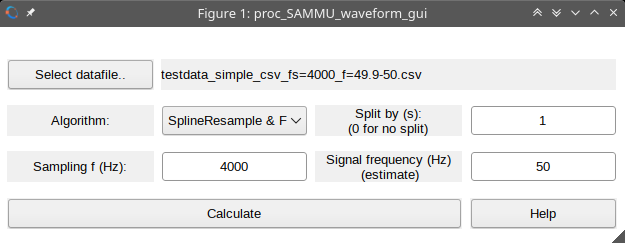
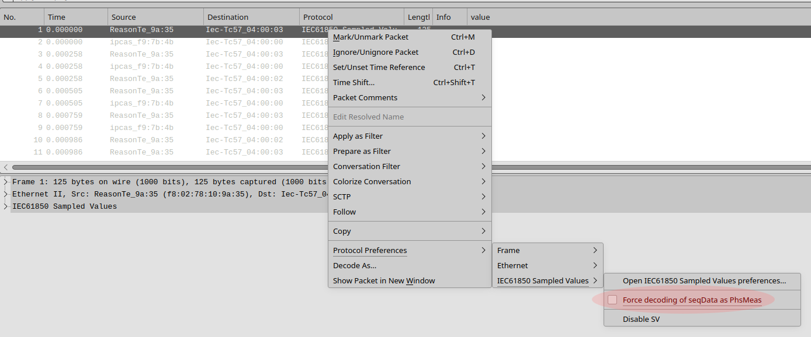
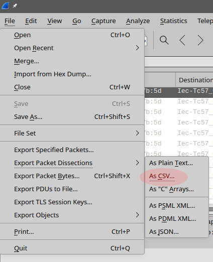

# Help for script proc_SAMMU_waveform_gui.m
Script is used to calculate signal properties using algorithms developed in the scope of [EPM Digital-IT](https://www.euramet.org/research-innovation/search-research-projects/details/project/metrology-for-digital-substation-instrumentation "EPM Digital-IT").

## Table of contents
<!-- vim-markdown-toc GFM -->

- [Requirements](#requirements)
- [How to run](#how-to-run)
- [How to use](#how-to-use)
- [Data file formats](#data-file-formats)
  - [csv with a vectors of numbers](#csv-with-a-vectors-of-numbers)
  - [csv as output from Wireshark](#csv-as-output-from-wireshark)
  - [mat file](#mat-file)
- [How to export data from Wireshark to csv](#how-to-export-data-from-wireshark-to-csv)
- [Results format](#results-format)

<!-- vim-markdown-toc -->

## Requirements
You need either [GNU Octave](https://octave.org "GNU Octave") or [Matlab](https://www.mathworks.com/products/matlab.html "Matlab").

Optional and issues:

You also need [Q-Wave Toolbox](https://github.com/qwtb/qwtb "Q-Wave Toolbox").
and algorithms from the repository
[EPMDigitalITsw](https://github.com/KaeroDot/EPMDigitalITsw "EPMDigitalITsw")
added to the QWTB. However both things will be **automatically** downloaded
during the first run so you do not have to do it by yourself.

If you use MSYS2 platform (and similar) - you will need unzip for automatic installation of the QWTB and DigitalIT algorithms.

## How to run
1. Download [this script proc_SAMMU_waveform_gui.m](https://github.com/KaeroDot/EPMDigitalITsw/blob/main/gui/proc_SAMMU_waveform_gui.m "Script proc_SAMMU_waveform_gui.m") using "Download raw file" on the right side of the linked webpage:

    

    and save it to your computer.
1. Run GNU Octave and Matlab, and start the downloaded script by typing command `proc_SAMMU_waveform_gui`.

## How to use
Main window:

- Button "Select datafile.." is used to open file dialog and to select a file
  with the sampled data. For accepted file formats see section [Data file formats](#data-file-formats).
- Selection "Algorithm:" is used to select the algorithm for processing the datafile.
- Input field "Split by (s)" use for splitting the processing by time. Write
  here a time in seconds. The data will be split into sections of this length.
  Results will be calculated for every section one after another. If value is
  set to zero, no splitting will be done and whole data will be calculated as
  one record. So if the datafile contains record long 5 seconds, and split will
  be set to 1 second, you will obtain 5 results.
- Input field "Sampling f (Hz)" is used to input value of the sampling frequency used to obtain the record.
- Input field "Signal frequency (Hz)" is used to input an estimate of the
  signal frequency, that is used in the calculation algorithms. E.g. for power
  measurement 50 Hz is sufficient estimate.
- Button "Calculate" runs the calculation.
- Button "Help" shows this help.

## Data file formats
The script can process data files with the following content:

1. csv (comma separated file) with a vectors of numbers representing a record,
1. csv (comma separated file) as output from [Wireshark](https://www.wireshark.org "Wireshark") export function,
1. mat file with single variable y.

### csv with a vectors of numbers
The datafile must be named with `.csv` file extension. The content must look like this:

    waveform1-sample1, waveform2-sample1, ..., waveformM-sample1
    waveform1-sample2, waveform2-sample2, ..., waveformM-sample2
    ...
    waveform1-sampleN, waveform2-sampleN, ..., waveformM-sampleN

### csv as output from Wireshark
The datafile must be named with `.csv` file extension. The content is output
from [Wireshark](https://www.wireshark.org "Wireshark") export function 
 See section [How to export data from Wireshark to csv](#how-to-export-data-from-wireshark-to-csv). The content of the file should
 look like this:

    "No.","Time","Source","Destination","Protocol","Length","svId","smpCnt","smpSynch","smp","value","Info"
    "1","0.000000","ABBMediu_40:7b:5d","Iec-Tc57_04:00:00","IEC61850 Sampled Values","120","A1MU0101","3979","local","1","350997,-611364,533608,-1484,20504599,-55945920,35080598,-803",""
    "2","0.000000","ABBMediu_40:7b:5d","Iec-Tc57_04:00:00","IEC61850 Sampled Values","120","A1MU0101","3980","local","2","365995,-652770,452398,-1618,24589209,-56411479,31485872,606",""
    "3","0.000000","ABBMediu_40:7b:5d","Iec-Tc57_04:00:00","IEC61850 Sampled Values","120","A1MU0101","3981","local","3","399429,-670361,388757,-1010,28505950,-56572835,27698602,-1688",""
    "4","0.000692","Cisco_06:67:c4","IEEEI&MS_00:00:00","PTPv2","60","","","","4","","Follow_Up Message"
    "5","0.000692","ABBMediu_40:7b:5d","Iec-Tc57_04:00:00","IEC61850 Sampled Values","120","A1MU0101","3982","local","5","449704,-664972,341597,-1298,32261875,-56389504,23710152,-967",""
    "6","0.000692","ABBMediu_40:7b:5d","Iec-Tc57_04:00:00","IEC61850 Sampled Values","120","A1MU0101","3983","local","6","499700,-651976,293696,-1467,35813726,-55754921,19584659,-1953",""
    "7","0.001325","ABBMediu_40:7b:5d","Iec-Tc57_04:00:00","IEC61850 Sampled Values","120","A1MU0101","3984","local","7","536308,-644659,236845,-985,39139255,-54805384,15365799,-1453",""

Rows with all zero or empty values are ignored.

Data with multiple signal sources are not yet supported.

### mat file
The datafile must be named with `.mat` file extension. It should contain only
one variable `y`, that is a matrix of size `NxM` with `M` waveforms each of `N`
samples. That means column records.

## How to export data from Wireshark to csv
[Wireshark](https://www.wireshark.org "Wireshark") is used to capture data
streams from SAMMU. Wireshark data has to be expoted to csv in this way:
1. In Wireshark, right-click on any packet and force the decoding of seqData as
PhsMeas using `Protocol Preferences->IEC61850 Sampled Values->Force decoding of seqData as PhsMeas`:

    
    
    (For details see [IEC 61850 9-2 Sampled Values, Wireshark, and the "Cloudy" effect](https://www.linkedin.com/pulse/iec-61850-9-2-sampled-values-wireshark-cloudy-effect-silveira/) )
1. Export data as csv file using menu `File->Export Packet Dissections->As CSV`:

    

1. You should obtain file with content as shown in section [Data file formats - csv as output from Wireshark](#csv-as-output-from-wireshark).

## Results format
Results of the calculation are saved into the directory containing the datafile.
- All shown figures are saved as files with `.fig` extension. You can open this file in Matlab or GNU Octave.
- Calculated results are saved in file with `.mat` extension. You can open this
  file in Matlab or GNU Octave. The file contains variables:
  1. Cell of structures `DOmain`. Each cell contains result quantities amplitude and phase of the main signal component.
  1. Cell of structures `DOspectrum`. Each cell contains result quantities with spectrum and its properties.
  1. Cell of structures `DI` with input quantities for the algorithm calculation.
  1. Matrix `y` with samples of the waveforms.

Cell of structures `DOmain`, `DOspectrum` and `DI` represents input and output
quantities for one section (as determined by "Split by (s)") and one waveform,
where e.g. `DOmain{j, k}` is result for waveform `j` and section `k`. Cell
contains structure with quantities according QWTB format.

