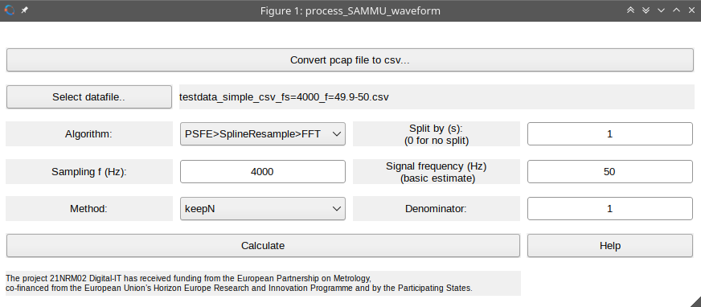
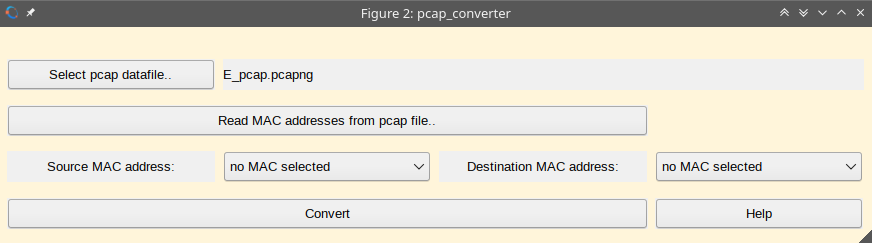
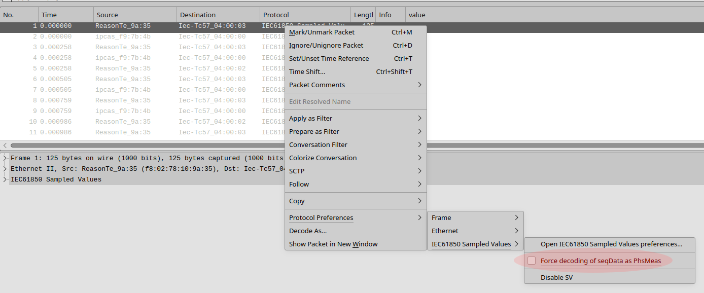
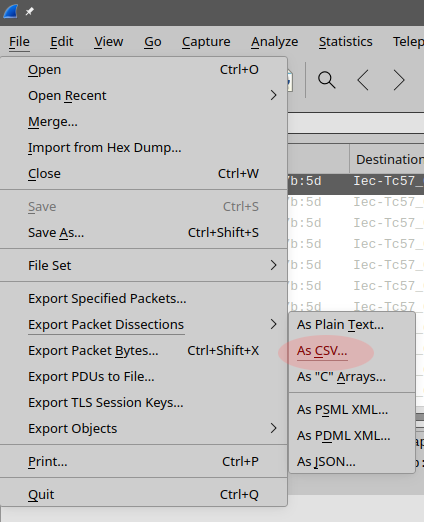

# Help for script proc_SAMU_waveform_gui.m

`proc_SAMU_waveform_gui` is used to calculate signal properties using
algorithms developed in the scope of [EPM
Digital-IT](https://www.euramet.org/research-innovation/search-research-projects/details/project/metrology-for-digital-substation-instrumentation
"EPM Digital-IT"). Sampled data can be loaded from `.pcap` of `.csv` files.
Algorithms calculate frequency, amplitude and phase.

## 1. Table of contents
<!-- vim-markdown-toc GFM -->

- [1. Table of contents](#1.-table-of-contents)
- [2. Requirements](#2.-requirements)
- [3. How to install and run](#3.-how-to-install-and-run)
  - [3.1 Manual installation](#3.1-manual-installation)
- [4. How to use](#4.-how-to-use)
  - [4.1 Main window](#4.1-main-window)
  - [4.2 Conversion window](#4.2-conversion-window)
- [5. Input data file formats](#5.-input-data-file-formats)
  - [5.1 .csv with a vectors of numbers](#5.1-.csv-with-a-vectors-of-numbers)
  - [5.2 .csv as output from Wireshark](#5.2-.csv-as-output-from-wireshark)
  - [5.2.1 How to export data from Wireshark to csv](#5.2.1-how-to-export-data-from-wireshark-to-csv)
  - [5.3 .mat file](#5.3-.mat-file)
  - [5.4 .pcap or .pcapng file](#5.4-.pcap-or-.pcapng-file)
- [6. Results format](#6.-results-format)
- [7. This webpage](#7.-this-webpage)

<!-- vim-markdown-toc -->

## 2. Requirements

You need either [GNU Octave](https://octave.org "GNU Octave") or
[Matlab](https://www.mathworks.com/products/matlab.html "Matlab").

*Optionally* you can need [Wireshark](https://www.wireshark.org "Wireshark")
and its console version `tshark` (part of standard installation) to read and
convert `.pcap` or `.pcapng` files.

*Optionally* you will also need
[Q-Wave Toolbox](https://github.com/qwtb/qwtb "Q-Wave Toolbox")
and algorithms from the repository
[EPMDigitalITsw](https://github.com/KaeroDot/EPMDigitalITsw "EPMDigitalITsw")
added to the QWTB. However both things will be **automatically** downloaded
during the first run so you do not have to do it by yourself.

If you use MSYS2 platform (and similar) on MS Windows: you will need unzip for
automatic installation of the QWTB and DigitalIT algorithms.

## 3. How to install and run

1. Download
[this script proc_SAMU_waveform_gui.m](https://github.com/KaeroDot/EPMDigitalITsw/blob/main/gui/proc_SAMU_waveform_gui.m "Script proc_SAMU_waveform_gui.m")
    using "Download raw file" on the right side of the linked webpage:

    

    and save it to your computer.
1. Run GNU Octave and Matlab, and run the downloaded script by typing command `proc_SAMU_waveform_gui`.

### 3.1 Manual installation

1. Download [this script proc_SAMU_waveform_gui.m](https://github.com/KaeroDot/EPMDigitalITsw/blob/main/gui/proc_SAMU_waveform_gui.m "Script proc_SAMU_waveform_gui.m").
2. Download [QWTB](https://github.com/qwtb/qwtb "Q-Wave Toolbox") and put it
   into  to GNU Octave or Matlab path.
3. Downlaod [algorithms from this project](https://github.com/KaeroDot/EPMDigitalITsw/tree/main/algorithms_for_QWTB "Digital-IT algorithms") and put them into QWTB directory.
4. Download [Wireshark](https://www.wireshark.org "Wireshark").

## 4. How to use

### 4.1 Main window

- Button `Convert pcap file to csv...` shows a new window for conversion of `.pcap` files,
see section [4.2 Conversion window](#4.2-conversion-window).
- Button `Select datafile..` is used to open file dialog and to select a file
  with the sampled data. For accepted file formats see section [Input data file formats](#5.-input-data-file-formats).
- Selection `Algorithm:` is used to select the algorithm for processing the datafile.
- Input field `Split by (s)` use for splitting the processing by time. Write
    here a time in seconds. The data will be split into sections of this
    length. Results will be calculated for every section one after another. If
    value is set to zero, no splitting will be done and whole data will be
    calculated as one record. So if the datafile contains record long 5
    seconds, and split will be set to 1 second, you will obtain 5 results.
- Input field `Sampling f (Hz)` is used to input value of the sampling
  frequency used to obtain the record.
- Input field `Signal frequency (Hz)` is used to input an estimate of the
  signal frequency, that is used in the calculation algorithms. E.g. for power
  measurement 50 Hz is sufficient estimate. The error of the estimate should
  not be larger than 10 %.
- Inputs and selections `Method`, `Denominator`, `Maximum relative amplitude
  error` and `Samples per period of the signal` are relevant to the selected
  algorithm. For details please take a look at the documentation of the
  algorithms.
- Button `Calculate` runs the calculation.
- Button `Help` shows this help.

#### 4.2 Conversion window

- Button `Select pcap datafile...` is used to open file dialog and to select a `.pcap` or `.pcapng` file with sampled data.
- Button `Read MAC addresses from pcap file` is used to run `tshark` (part of Wireshark) and to
read available MAC addresses of sources and destination devices in the selected
`pcap` or `pcapng` file.
- Selections `Source MAC address:` and `Destination MAC address` are used to select desired source and destination device.
- Button `Convert` will run `tshark` (part of Wireshark) to create `.csv` file from selected `.pcap` or `.pcapng` file and MAC addresses. The created `.csv` file will be preselected in the main window as the datafile.
- Button `Help` shows this help.

## 5. Input data file formats

The script can process data files with the following content:

1. `.csv` (comma separated file) with a vectors of numbers representing a record.
1. `.csv` (comma separated file) as output from [Wireshark](https://www.wireshark.org "Wireshark") export function,
1. `.mat` file with single variable y.
1. `.pcap` or `.pcapng` file.

### 5.1 `.csv` with a vectors of numbers

The datafile must be named with `.csv` file extension. Each column represents one sampled waveform. The content must look like this:

    waveform1-sample1, waveform2-sample1, ..., waveformM-sample1
    waveform1-sample2, waveform2-sample2, ..., waveformM-sample2
    ...
    waveform1-sampleN, waveform2-sampleN, ..., waveformM-sampleN

### 5.2 `.csv` as output from Wireshark

The datafile must be named with `.csv` file extension. The content is output
from [Wireshark](https://www.wireshark.org "Wireshark") export function
 See section [How to export data from Wireshark to csv](#how-to-export-data-from-wireshark-to-csv). The content of the file should
 look like this:

    "No.","Time","Source","Destination","Protocol","Length","svId","smpCnt","smpSynch","smp","value","Info"
    "1","0.000000","ABBMediu_40:7b:5d","Iec-Tc57_04:00:00","IEC61850 Sampled Values","120","A1MU0101","3979","local","1","350997,-611364,533608,-1484,20504599,-55945920,35080598,-803",""
    "2","0.000000","ABBMediu_40:7b:5d","Iec-Tc57_04:00:00","IEC61850 Sampled Values","120","A1MU0101","3980","local","2","365995,-652770,452398,-1618,24589209,-56411479,31485872,606",""
    "3","0.000000","ABBMediu_40:7b:5d","Iec-Tc57_04:00:00","IEC61850 Sampled Values","120","A1MU0101","3981","local","3","399429,-670361,388757,-1010,28505950,-56572835,27698602,-1688",""
    "4","0.000692","Cisco_06:67:c4","IEEEI&MS_00:00:00","PTPv2","60","","","","4","","Follow_Up Message"
    "5","0.000692","ABBMediu_40:7b:5d","Iec-Tc57_04:00:00","IEC61850 Sampled Values","120","A1MU0101","3982","local","5","449704,-664972,341597,-1298,32261875,-56389504,23710152,-967",""
    "6","0.000692","ABBMediu_40:7b:5d","Iec-Tc57_04:00:00","IEC61850 Sampled Values","120","A1MU0101","3983","local","6","499700,-651976,293696,-1467,35813726,-55754921,19584659,-1953",""
    "7","0.001325","ABBMediu_40:7b:5d","Iec-Tc57_04:00:00","IEC61850 Sampled Values","120","A1MU0101","3984","local","7","536308,-644659,236845,-985,39139255,-54805384,15365799,-1453",""

Rows with all zero or empty values are ignored.

However you should export only single stream, so exporting `.pcap` file with
multiple sources and destinations will mix data together. In this case, use
conversion of `.pcap` files integrated into the script
`proc_SAMU_waveform_gui.m` software.

#### 5.2.1 How to export data from Wireshark to csv

[Wireshark](https://www.wireshark.org "Wireshark") is used to capture data
streams from SAMU. Wireshark data has to be expoted to csv in this way:

1. In Wireshark, right-click on any packet and force the decoding of seqData as
   PhsMeas using `Protocol Preferences->IEC61850 Sampled Values->Force decoding
of seqData as PhsMeas`:

    

    (For details see [IEC 61850 9-2 Sampled Values, Wireshark, and the "Cloudy"
    effect](https://www.linkedin.com/pulse/iec-61850-9-2-sampled-values-wireshark-cloudy-effect-silveira/)
    )
1. Export data as csv file using menu `File->Export Packet Dissections->As
   CSV`:

    

1. You should obtain file with content as shown in section [Data file formats -
   csv as output from Wireshark](#csv-as-output-from-wireshark).

### 5.3 `.mat` file

The datafile must be named with `.mat` file extension. It should contain only
one variable `y`, that is a matrix of size `NxM` with `M` waveforms each of `N`
samples. That means column records.

### 5.4 `.pcap` or `.pcapng` file

This file is generated by [Wireshark](https://www.wireshark.org "Wireshark") software.
`proc_SAMU_waveform_gui` can convert such a file into a simple `.csv` by using `tshark` (part of Wireshark). See section [Conversion window](#4.2-conversion-window).

## 6. Results format

Results of the calculation are saved into the directory containing the datafile.

- All shown figures are saved as files with `.fig` extension. You can open this file in Matlab or GNU Octave.
- Calculated results are saved in file with `.mat` extension. You can open this
  file in Matlab or GNU Octave. The file contains variables:
  1. Cell of structures `DOmain`. Each cell contains result quantities amplitude and phase of the main signal component.
  1. Cell of structures `DOspectrum`. Each cell contains result quantities with spectrum and its properties.
  1. Cell of structures `DI` with input quantities for the algorithm calculation.
  1. Matrix `y` with samples of the waveforms.

Cell of structures `DOmain`, `DOspectrum` and `DI` represents input and output
quantities for one section (as determined by "Split by (s)") and one waveform,
where e.g. `DOmain{j, k}` is result for waveform `j` and section `k`. Cell
contains structure with quantities according [QWTB](https://github.com/qwtb/qwtb "Q-Wave Toolbox") format.

## 7. This webpage

This webpage address was shortened as: [https://tinyurl.com/digitalITgui](https://tinyurl.com/digitalITgui)
